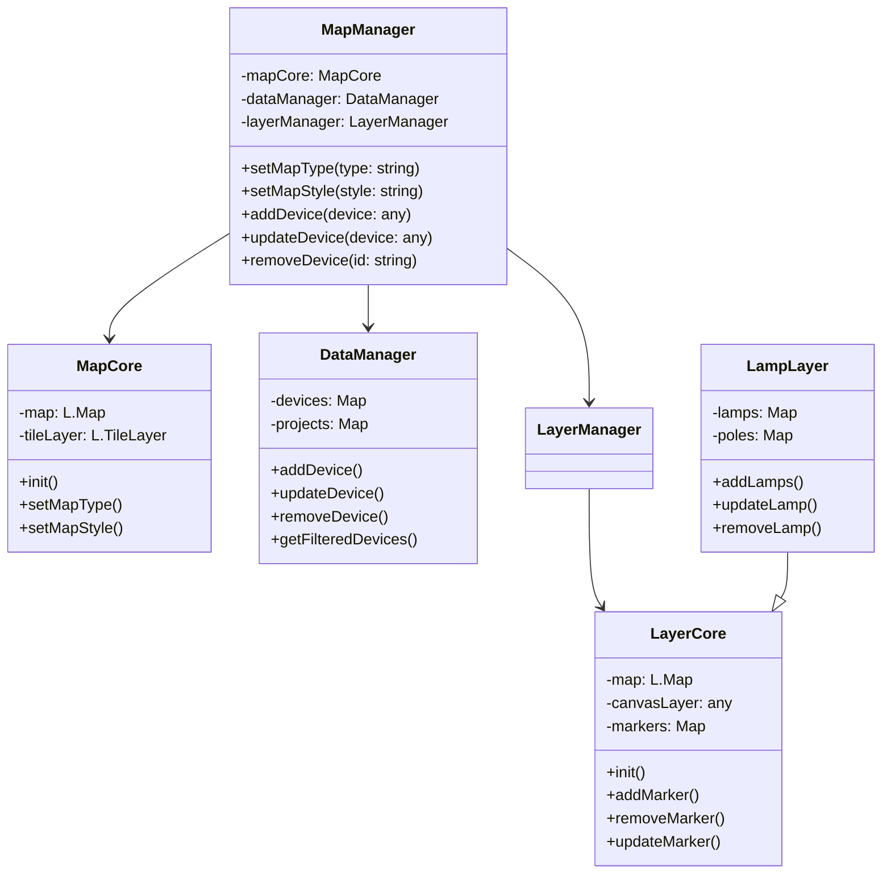
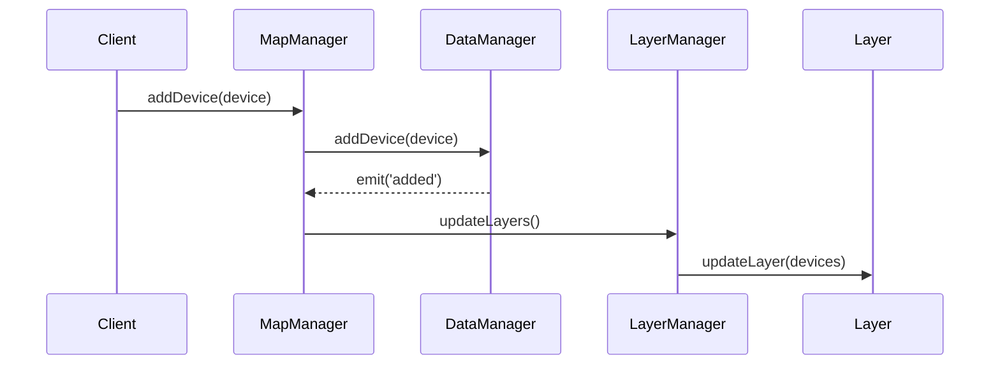

# GeoMatrixCore

基于 Leaflet 的地图应用框架，提供设备管理、图层控制等功能。GeoMatrixCore 是一个高性能、可扩展的地图应用开发框架，专注于设备管理和图层控制，为开发者提供简单而强大的地图应用开发能力。

## 特性
- 🗺️ 支持多种地图服务
  - 支持百度地图、谷歌地图等多种地图服务
  - 统一的地图操作接口，轻松切换地图服务商
- 📱 设备实时状态展示
  - 高效的设备状态更新机制
  - 自动化的数据同步和状态管理
- 🎨 高性能图层渲染
  - 基于 Canvas 的高性能图层渲染
  - 支持大规模设备标记点展示
- 🔄 数据实时同步
  - 实时数据更新和状态同步
  - 支持 WebSocket 等多种数据传输方式
- 🛠️ 灵活的扩展机制
  - 插件化的架构设计
  - 支持自定义图层和控件

## 安装

```bash
npm install geomatrix-core
# 或
yarn add geomatrix-core
```

## 快速开始

```typescript
import { MapManager } from 'geomatrix-core';

// 初始化地图管理器
const mapManager = new MapManager({
  container: 'map',
  mapType: 'baidu',
  center: [39.908685, 116.397465],
  zoom: 12
});

// 添加设备
mapManager.addDevice({
  id: 'device-001',
  type: 'lamp',
  position: [39.908685, 116.397465],
  status: 'online'
});
```

## 架构设计

### 目录结构
```tree
GeoMatrixCore/
├── common/               # 通用定义
│   ├── constants.ts      # 常量定义
│   ├── enums.ts         # 枚举定义
│   └── types.ts         # 类型定义
├── config/              # 配置文件
│   ├── map.ts          # 地图配置
│   └── layer.ts        # 图层配置
├── core/               # 核心功能
│   └── MapCore.ts     # 地图核心功能
├── data/              # 数据管理
│   ├── DataManager.ts # 数据管理器
│   ├── types.ts       # 数据类型定义
│   └── filters/       # 数据过滤器
├── layer/             # 图层管理
│   ├── LayerCore.ts   # 图层基类
│   ├── LampLayer.ts   # 灯具图层
│   └── ...           # 其他设备图层
├── utils/            # 工具类
│   └── icon.ts      # 图标工具
└── MapManager.ts    # 总管理器
```

### 类图


### 时序图


## API 文档

### MapManager

地图管理器，负责整个地图应用的生命周期管理。

#### 构造函数
```typescript
new MapManager(options: MapOptions)
```

#### 配置项
```typescript
interface MapOptions {
  container: string;      // 地图容器ID
  mapType: string;        // 地图类型：'baidu' | 'google'
  center: [number, number]; // 中心点坐标
  zoom: number;           // 缩放级别
}
```

#### 方法
- `setMapType(type: string)`: 设置地图类型
- `setMapStyle(style: string)`: 设置地图样式
- `addDevice(device: Device)`: 添加设备
- `updateDevice(device: Device)`: 更新设备
- `removeDevice(id: string)`: 移除设备

## 贡献指南

我们欢迎所有形式的贡献，包括但不限于：

- 提交问题和建议
- 提交代码改进
- 完善文档

### 开发流程

1. Fork 项目
2. 创建特性分支 (`git checkout -b feature/xxx`)
3. 提交改动 (`git commit -am 'Add some feature'`)
4. 推送到远程分支 (`git push origin feature/xxx`)
5. 创建 Pull Request

## 开源协议

本项目采用 [MIT](LICENSE) 协议。
